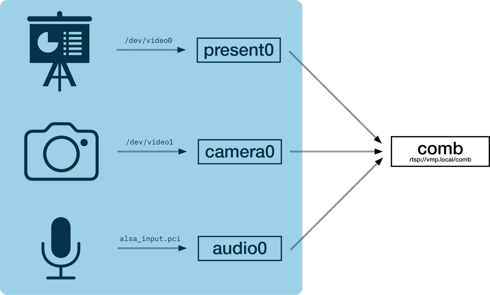

---
title: "The Virtual Streaming Processor (VMP)"
author: [Hugo Melder]
date: "4th January 2024"
lang: en
book: true
toc: true

fontsize: 12pt
mainfont: EB Garamond
sansfont: Inter
monofont: "IBM Plex Mono"
...

# Overview

## How to use this document
We encourage you to read this document in its entirety, as it provides a comprehensive
overview of the VMP project. Feel free to pause and experiment with the code and
examples provided.

The goal is to provide a comprehensive guide for both deployment and development.
First by giving you a birds-eye view of the architecture, and then by diving into
the technical details.

If you are only interested in deployment and administration, you can skip the
in depth technical chapters which may require knowledge of the GStreamer multimedia
framework.

## Requirements
This document assumes you have a basic understanding of multimedia processing, and
have experience with administering a Linux system.

If you are interested in development, you should first familiarize yourself with
Objective-C, and the GStreamer multimedia framework.
Various GStreamer demos and tutorials are available on the official website, and
specific demos which were eventually integrated into the VMP project are available
in `Demos/`.

# Chapter 1. Introduction

The importance of livestreaming university lectures and other related events has
surged due to multiple factors. First, there is the growing number of students
which builds pressure on building more and notably larger lecture halls. This is
not economically feasible in the long run. Additionally, growing portfolio, and
interdiciplnary courses also increases the likelyhood of overlapping lectures.
This was accelerated in part of the pandemic, which necessitated a way to attend
a lecture remotely.

Building a reliable system for streaming, processing, and
distributing multiple lectures at the same time is not trivial.

A good system should not introduce any complexity for the lecturer. This means
the system should transparently capture the presentation, camera, and audio
feeds, instead of requiring the lecturer to self-stream using software like OBS.

This requires some form of edge computing device in each lecture hall,
equipped with video and audio capturing capabilities, as well as the power to
blend and encode multiple feeds in real time. The resulting stream is then published
via RTSP, or as a raw network stream.

In theory, compositing — the combination of multiple video and/or audio feeds — can
also be transferred to a data center. However, this necessitates
hardware-accelerated video processing, typically performed using GPUs. Since
edge devices also need to encode the streams to minimize bandwidth, which in
turn requires hardware acceleration, there is usually capacity for additional
blending as well.

With these requirements, one often ends up relying on expensive television
equipment, which is not scalable across numerous lecture halls and seminar
rooms.

The VMP project aims to utilize commodity hardware to fulfill the aforementioned
requirements at a fraction of the cost of comparable commercial equipment.

# Chapter 2. Architecture 

The VMP project is by design hardware-agnostic. Unique hardware capabilities, can be
described by a profile which are usually located in `/usr/share/vmpserverd/profiles`.

On startup, the *VMP daemon (vmpserverd)* reads the profiles and probes the
enviroment to determine the best profile to use.

But what does the VMP daemon do? It is the core of the VMP project, processing
the video and audio feeds, and exposing them via RTSP. Additionally, there is
also an option for recording the processed streams to disk. But that is just
the gist of it.

The VMP daemon is built on top of the GStreamer multimedia framework, which
provides a pipeline-based model for constructing multimedia workflows.

In practise, you do not have to be aware of the underlying pipelines as we
provide a set of predefined *channels* and *mountpoints* for most use cases.

Think of *channels* as a way to describe the processing of an input stream, such
as a capture card. A channel will always expose an interface in which other
modules can grab the resulting stream. An example would be a presentation channel
that grabs the presentation feed from a capture card via V4L2 (let's say
`/dev/video0`), and scales it to 1920x1080p.

A *mountpoint* then takes one or more channels, processes and encodes them, and
packages them into a network stream. This is then exposed via RTSP at a path
described by the mountpoint. A mountpoint in turn mounts a network-stream to
a given RTSP path.

## 2.1 Terminology

In this section, we define key terms to ensure consistency throughout this document:

### GNUstep
GNUstep is an open-source cross-platform reimplementation of the Apple Cocoa
frameworks, including a modern Objective-C runtime, implementing a superset of
Objective-C 2.0, and Foundation Kit, which the effective standard library.

### GStreamer
GStreamer is an open-source multimedia framework. It employs a pipeline-based
model, allowing the construction of various components (such as audio and video
playback, recording, streaming, and editing) into a comprehensive multimedia
workflow.

### HDCP (High-bandwidth Digital Content Protection)
HDCP is a technology protect the capturing of protected content, namely movies
on a hardware level.

### NixOS
A Linux distribution based on the functional nix package manager, which
allows for declarative configuration, package-level isolation, and reproducible builds.

### Objective-C
Objective-C is an object-oriented programming language that adds Smalltalk-style
messaging to the C programming language. Technologies such as Key-Value-Observing (KVO),
and a rich standard library (namely Foundation) makes it a good choice for multimedia
applications.

### Property List
Property list files are files that store serialized objects. We are using the XML
variant of property lists to store the configuration data of the VMP daemon, as well
as GStreamer pipeline profiles.

### RTSP (Real Time Streaming Protocol)
RTSP is used to negotiate and control media sessions between endpoints, allowing
clients to request real-time video and audio feeds.

### Video 4 Linux (V4L2)
Video 4 Linux (V4L2) is a Linux kernel video capture and output API which streamlines
interaction with various different capture cards.

### Video Acceleration API (VA-API)
VA-API provides a standardized interface for accessing hardware-accelerated
video processing capabilities. It supports encoding, decoding, processing, and
filtering operations, making it hardware and vendor-agnostic.

## 2.2 Multimedia Pipelines

## 2.3 Channels


An input stream is abstracted by a _channel_, which has a unique channel
name, the type, and type-specific properties like the device path for a v4l2
source.

The channel name is used to map the channel to output streams.



This way, the nitty-gritty details of inter-pipeline communication, buffering, and configuration is
abstracted from the user, and the user can focus on the high-level configuration of the daemon.

The following types of channels are currently supported:
- `v4l2`: A channel which reads from a v4l2 device.
- `videoTest`: A channel which generates a test video stream.
- `audioTest`: A channel which generates a test audio stream.
- `pulse`: A channel which reads from a pulseaudio source.

## 2.4 Mountpoints

An output stream is abstracted by a _mountpoint_, which has a unique path (used
as the path component of the RTSP URL), the type of mountpoint, and
type-specific properties like channel mappings, or bitrate.

Currently, the following types of mountpoints are supported:

- `single`: Exposes a single video channel, and an audio channel.
- `combined`: Combines two video channels into a single video stream, and adds an audio channel.

A mountpoint is directly managed by the RTSP server, including the lifetime of
the media pipeline, and negotiation between clients using RTSP. Internally, a
mountpoint pipeline configuration exposes one or more RTP streams.

## 2.5 Profiles

# Chapter 3. Deployment

## 3.1 Obtaining the Software

## 3.2 Property Lists
Property lists are a simple way to encode dictionaries, arrays, strings, numbers, booleans,
and arbitrary data. We use the XML flavour of a serialized property list to configure
the VMP daemon, so it is important to understand the format, before moving on to the
configuration.

The data types closely resemble the classes found in the `Foundation` framework, but are
generally independet of the framework.

Here is a list of the supported data types, and the Foundation class they correspond to. We use
the XML flavour of a serialized property list.

XML-Tag | Foundation Class | Type | Description
--- | --- | --- | ---
`<string>` | NSString | String | A UTF-8 encoded string
`<integer>` or `<real>` | NSNumber | Number | A integer, or floating point number
`<true/>` or `<false/>` | NSNumber | Boolean | A boolean value
`<data>` | NSData | Data | A sequence of bytes (Base64 encoded)
`<array>` | NSArray | Array | An ordered collection of objects
`<dict>` | NSDictionary | Dictionary | An unordered collection of key-value pairs

Here is an example of a property list with the preamble:
```xml
<?xml version="1.0" encoding="UTF-8"?>
<!DOCTYPE plist PUBLIC "-//Apple//DTD PLIST 1.0//EN" "http://www.apple.com/DTDs/PropertyList-1.0.dtd">
<plist version="1.0">
<dict>
	<key>key1</key>
	<string>value1</string>
	<key>key2</key>
	<integer>42</integer>
	<key>key3</key>
	<array>
		<string>value2</string>
		<string>value3</string>
	</array>
</dict>
</plist>
```

A big advantage of property list is the tight integration with the Foundation framework, which
is used throughout the project. Multi-line string support is also available, which is useful
for describing long GStreamer pipelines.


## 3.3 Configuration

On startup, the daemon checks for a configuration file (in the following order)
at `~/.config/vmpserverd/config.plist`, `/etc/vmpserverd/config.plist`, and
`/usr/share/vmpserverd/config.plist`.
Additionally, the daemon can be started with a custom configuration file via the
`-c` command line option.

The configuration file is a property list, with a dictionary as the root object. The following
keys are required:

Key | Type | Description
--- | --- | ---
`name` | String | The name of the configuration
`profileDirectory` | String | The path to the directory containing the platform-specific profiles
`scratchDirectory` | String | The path to the directory where recordings are stored
`rtspAddress` | String | The address to bind the RTSP server to
`rtspPort` | Number | The port to bind the RTSP server to
`httpPort` | Number | The port to bind the HTTP server to
`httpAuth` | Boolean | Whether to enable HTTP basic authentication
`httpUser` | String | The username for HTTP basic authentication
`httpPassword` | String | The password for HTTP basic authentication
`gstDebug` | String | The GStreamer debug configuration
`mountpoints` | Array | An array of mountpoint configurations
`channels` | Array | An array of channel configurations

The simplest way to get started is to copy the default configuration file in
`/usr/share/vmpserverd/profiles` to your home directory, and modify it to your
needs. Below is a description of the different configurations.

The following snippets omit the preamble of the property list, and only show the
key-value pairs.

### Server Configuration Parameters

Here is a snippet of parameters for the server configuration:
```XML
    <key>name</key>
    <string>Example Configuration</string>
    <key>profileDirectory</key>
    <string>/home/vm/TUMmp/vmpserverd/profiles</string>

    <key>rtspAddress</key>
    <string>0.0.0.0</string>
    <key>rtspPort</key>
    <string>8554</string>

    <key>httpPort</key>
    <string>8080</string>
    <key>httpAuth</key>
    <false/>
    <key>httpUsername</key>
    <string>admin</string>
    <key>httpPassword</key>
    <string>password</string>

    <key>gstDebug</key>
    <string>*:2</string>
```

#### Channels

The channels are configured via an array of channel configurations. Each channel configuration
is a dictionary. Note that keys in the `properties` dictionary are specific to the channel type.

##### `videoTest` channel
Outputs a test video stream based on the GStreamer `videotestsrc` element. It is a SMPTE test pattern.
Available properties:

Key | Required | Description
--- | --- | ---
`width` | Yes | The width of the video stream
`height` | Yes | The height of the video stream

Example:
```xml
<dict>
	<key>name</key>
	<string>test0</string>
	<key>type</key>
	<string>videoTest</string>
	<key>properties</key>
	<dict>
		<key>width</key>
		<integer>1920</integer>
		<key>height</key>
		<integer>1080</integer>
	</dict>
</dict>
```

##### `v4l2` channel
Opens a v4l2 (Video4Linux2) device, and outputs the video stream. Available properties:

Key | Required | Description
--- | --- | ---
device | Yes | The path to the v4l2 device

Example:
```xml
<dict>
	<key>name</key>
	<string>present0</string>
	<key>type</key>
	<string>v4l2</string>
	<key>properties</key>
	<dict>
		<key>device</key>
		<string>/dev/video0</string>
	</dict>
</dict>
```

##### `audioTest` channel
Outputs a test audio stream based on the GStreamer `audiotestsrc` element.
Currently, no properties are available for this channel type.

Example:
```xml
<dict>
    <key>name</key>
    <string>audio0</string>
    <key>type</key>
    <string>audioTest</string>
    <key>properties</key>
    <dict>
    </dict>
</dict>
```

##### `pulse` channel
Opens a pulseaudio source, and outputs the audio stream. Available properties:

Key | Required | Description
--- | --- | ---
device | Yes | The name of the pulseaudio source (e.g. `alsa_input.usb-XXXX.analog-stereo`)

Example:
```xml
<dict>
	<key>name</key>
	<string>audio0</string>
	<key>type</key>
	<string>pulse</string>
	<key>properties</key>
	<dict>
		<key>device</key>
		<string>alsa_input.usb-XXXX.analog-stereo</string>
	</dict>
</dict>
```

#### Mountpoints

The mountpoints are configured via an array of mountpoint configurations. Each mountpoint
configuration is a dictionary. Note that keys in the `properties` dictionary are specific to the
mountpoint type.

##### `single` mountpoint

Exposes a single video channel, and an audio channel. Available properties:

Key | Required | Description
--- | --- | ---
`videoChannel` | Yes | The name of the video channel
`audioChannel` | Yes | The name of the audio channel

Example:
```xml
<dict>
	<key>name</key>
	<string>Presentation</string>
	<key>path</key>
	<string>/presentation</string>
	<key>type</key>
	<string>single</string>
	<key>properties</key>
	<dict>
		<key>videoChannel</key>
		<string>present0</string>
		<key>audioChannel</key>
		<string>audio0</string>
	</dict>
</dict>
```

##### `combined` mountpoint

Combines two video channels into a single video stream, and adds an audio channel.
The properties are the same as for the `single` mountpoint, with the addition of a
required `secondaryVideoChannel` property.

Example:
```xml
<dict>
    <key>name</key>
    <string>Combined</string>
    <key>path</key>
    <string>/comb</string>
    <key>type</key>
    <string>combined</string>
    <key>properties</key>
    <dict>
        <key>videoChannel</key>
        <string>present0</string>
        <key>secondaryVideoChannel</key>
        <string>camera0</string>
        <key>audioChannel</key>
        <string>audio0</string>
    </dict>
</dict>
```

# Chapter 4. Development
